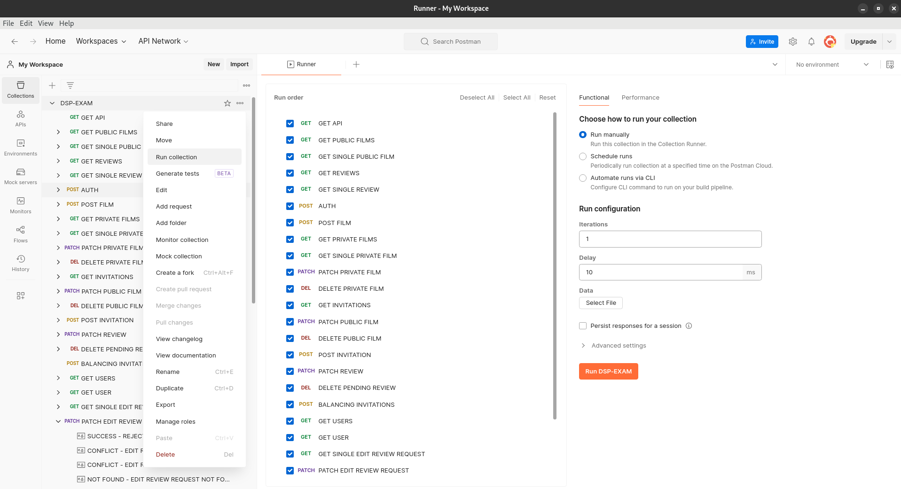

## REST APIs Design

This folder must contain the full Open API documentation of the REST APIs, including examples of JSON documents to be used when invoking the operations, and examples of invocations of the API operations, as a Postman collection .

## Postman Collection

The Postman collection is included to help with API testing. 
- Import the provided Postman collection JSON file `DSP-EXAM.postman_collection.json` into your Postman app.
- All available `endpoints are documented`.
- Example requests for each endpoint are included.
- Pre-configured user accounts (such as User) are set up for quick testing.

The Postman collection includes tests for all endpoints as documented in the Open API file. To speed up testing, you can use a single user (User 1). Inside the `example-schema` folder, there are examples organized into folders for films, reviews, users, and edit-review-requests based on the JSON schemas defined in the `JSON Schemas` folder. These examples may not be necessary for testing, as the `DSP - EXAM.postman_collection.json` file already contains all the necessary test cases.

An important feature of Postman is the ability to perform automated tests. Each request has multiple examples, where each one aims to test a different case for the endpoint to observe the various response types and HTTP status codes. However, the simple test I have written to verify the response status code is valid only for the main request and not for the example requests, as it's not possible to differentiate tests between the examples.

